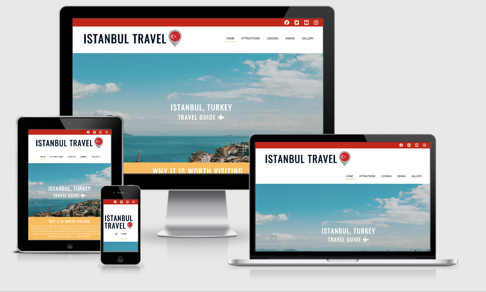
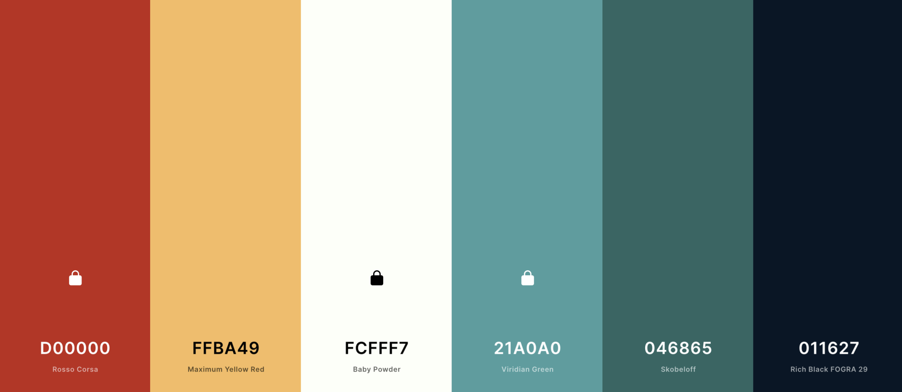
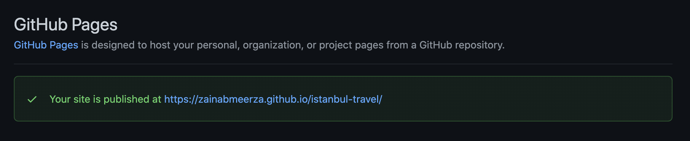

<h1><strong>Istanbul Travel</strong></h1>

<h2>Code Institute Milestone Project 1 in User-Centric Frontend Development</h2>

    The aim of the first project is to develop a static front-end website with at least three individual pages using HTML and CSS. The website is designed such that it follows industry standard UX conventions. This website is made for educational purposes only. 

<a href="https://zainabmeerza.github.io/istanbul-travel/" target="_blank" >View the live website in GitHub Pages</a>

This image is produced using the tool from <a href="http://ami.responsivedesign.is/#" target="_blank">Am I Responsive</a>

This website is created to provide guidance and help for tourists that are interested in visiting Istanbul, Turkey. It equips them with
all the necessary information in order to encourage and guide them to plan a trip to the city. Information such as attraction spots, accomadation suggestions, restraunts to dine in as well as keeping them updated with the latest events that may be taking place during their visit. 

The website is divided into the following sections listed below:
    <ol>
        <li>Home page - to provide the user and introduction and overview of what the webiste is about.</li>
        <li>Attractions page - to provide a list of the top sightseeing spots that travellers should visit.</li>
        <li>Lodging page - to compile together the best accomadation spots such as hotels, hostels, bed&breakfats, and resorts that they can stay in (with linked reviews from previous customers).</li>
        <li>Dining page - to provide them with a list of the finest restraunts, cafes and bakeries (with linked reviews from previous customers)</li>
        <li>Gallery page - to display a variety of pictures of the city and it's culture.</li>
        <li>Form page - for the user to sign up to subscribe to a newsletter </li>
    </ol>

<h3><strong>The business goals of this website are the following:</strong></h3>
    <ul>
        <li></li>
        <li></li>
        <li></li>
        <li></li>
        <li></li>
    </ul>

<h3><strong>The customer goals of this website are the following:</strong></h3>
 <ul>
        <li>Search for a reliable and updated source which provide users with trustworthy recommendations on places to visit.</li>
        <li>Have a compelling </li>
        <li>To find outt more information on the city of Istanbul, and the variety of activites that are available to do there. </li>
        <li>To view </li>
        <li></li>
</ul>

 
 
<h1><strong>UX</strong></h1>

<h2><strong>Strategy</strong></h2>
 
 

<h2><strong>Scope</strong></h2>
 
 
<h2><strong>Structure</strong></h2>
 
 
<h2><strong>Skeleton</strong></h2>

The website consits of six pages, but only four out of six were managed to be completed. The completed pages are; Home (introduces the user into the purpose of the website), Attractions (lists the top must sight-seeing locations that the user should visit), Gallery (displays a variety of images to provide the user with some insight as to what they should expect from the city), and Form (which includes a newsletter subscription form).

<h3>The wireframe mockups for each page:</h3>
<a href="https://github.com/zainabmeerza/istanbul-travel/blob/main/assets/images/wireframes/Home%20Page%20-%20Desktop.png" target="_blank" >Home - Desktop View</a> 
 
<a href="https://github.com/zainabmeerza/istanbul-travel/blob/main/assets/images/wireframes/Home%20Page%20-%20Mobile.png" target="_blank" >Home - Mobile View</a> 
 
<a href="https://github.com/zainabmeerza/istanbul-travel/blob/main/assets/images/wireframes/Attractions%20Page%20-%20Desktop.png" target="_blank" >Attraction - Desktop View</a> 
 
<a href="https://github.com/zainabmeerza/istanbul-travel/blob/main/assets/images/wireframes/Attractions%20Page%20-%20Mobile.png" target="_blank" >Attractions - Mobile View</a> 
 
<a href="https://github.com/zainabmeerza/istanbul-travel/blob/main/assets/images/wireframes/Lodging%20and%20Dining%20Page%20-%20Desktop.png" target="_blank" >Lodging & Dining - Desktop View</a> 
 
<a href="https://github.com/zainabmeerza/istanbul-travel/blob/main/assets/images/wireframes/Lodging%20%26%20Dining%20-%20Mobile.png" target="_blank" >Lodging & Dining - Mobile View</a> 
 
<a href="https://github.com/zainabmeerza/istanbul-travel/blob/main/assets/images/wireframes/Gallery%20Page%20-%20Desktop.png" target="_blank" >Gallery - Desktop View</a> 
 
<a href="https://github.com/zainabmeerza/istanbul-travel/blob/main/assets/images/wireframes/Gallery%20Page%20-%20Mobile.png" target="_blank" >Gallery - Mobile View</a> 
 
<a href="https://github.com/zainabmeerza/istanbul-travel/blob/main/assets/images/wireframes/Form%20Page%20-%20Desktop.png" target="_blank" >Form - Desktop View</a> 
 
<a href="https://github.com/zainabmeerza/istanbul-travel/blob/main/assets/images/wireframes/Form%20Page%20-%20Mobile.png" target="_blank" >Form - Mobile View</a> 
 
 

<h2><strong>Surface</strong></h2>

The color pallete used was generated by an online tool.Encorprating white and red into the colour scheme was important as it matched with the flag of Turkey.
 

<h1><strong>Technologies Used</strong></h1>
This project is based on HTML and CSS programming languages. Several technologies and tools were used to enable a functional design. These are listed below.
<ul>
<li>The three programming langauges;<strong> HTML5, CSS</strong> and <strong>JavaScript</strong>.</li>
<li><a href="https://www.gitpod.io/" target="_blank">GitPod</a> - Was the development environment used to write the code and build the project. </li>
<li><a href="https://github.com/" target="_blank">GitHub</a> - Was the platform used to hose the code that was written and pushed from GitPod. </li>
<li><a href="https://balsamiq.cloud" target="_blank">Balsamiq</a> - A rapid low-fidelity UI wireframing tool used to sketch a rough plan of the website structure and contents to abiding by rhe best UX practices. </li>
<li><a href="https://fontawesome.com/v6.0/icons?d=gallery&p=1&s=solid" target="_blank">FontAwesome</a> - The social media and title icons were taken from the toolkit provided by FontAwesome.</li>
<li><a href="https://fancyapps.com/docs/ui/fancybox/" target="_blank">FancyBox</a> - Used to create a gallery modal popup to display a slideshow of images. </li>
<li><a href="https://fonts.google.com/specimen/Oswald#pairings" target="_blank">Google Fonts</a> - Used to style the website fonts. </li>
<li><a href="https://developer.chrome.com/docs/devtools/" target="_blank">Chrome Development Tools</a> - Used to test every stage whilst building the website, to help find and fix bugs within the code and test the responsiveness of the pages.</li>
<li><a href="https://www.youtube.com/" target="_blank">Youtube</a> - To provide an embedded link to the videos on the home page.</li>
<li><a href="https://www.google.com/maps/place/%C4%B0stanbul,+Turkey/@41.0039643,28.4517462,9z/data=!3m1!4b1!4m5!3m4!1s0x14caa7040068086b:0xe1ccfe98bc01b0d0!8m2!3d41.0082376!4d28.9783589" target="_blank">Google Maps</a> - To provide an embedded link to the map on the home page.</li>
<li><a href="https://www.flaticon.com/free-icons/turkey" target="_blank">Flat Icon</a> - Used to select a favicon for the website. </li>
<li><a href="https://coolors.co/" target="_blank">Coloors</a> - To select a desired colour scheme for the website.</li>
<li><a href="https://validator.w3.org/" target="_blank">W3C Markup Validation Service</a> - This tool was used to check the markup validity of the HTML Web documents of this project.</li>
<li><a href="https://jigsaw.w3.org/css-validator/" target="_blank">W3C CSS Validation Service</a> - This tool was used to check the validity of the CSS documents of this project. </li>
<li><a href="http://ami.responsivedesign.is/" target="_blank">Am I Responsive</a> - Was used to generate a repsonive image; displaying how the website would look on different devices. </li>
<li><a href="https://wave.webaim.org/" target="_blank">WAVE Web Accessibility Evaluation Tool</a> - Tool used to detect any accessibility issues within the website to help further improve it.</li>
</ul>
 
 
<h1><strong>Testing</strong></h1>
 
 
<h1><strong>Features</strong></h1>
<h1><strong>Deployment</strong></h1>
This project was deployed via Gitpod. Using the git commands provided by Gitpod  the code was comitted to git, and then pushed onto GitHub.  It was then deployed onto the web using GitHub Pages.
 
 
<h2>Deploy on to GitHub Pages -</h2>
The following steps were carried out in order to deploy this project to GitHub Pages from its GitHub repository:
<ol>
<li>Log on to GitHub.</li>
<li>Select <strong>istanbul-travel</strong> from the list of repositories.</strong></strong></li>
<li>Within the repository, select <strong>settings</strong> from the menu located ta the top of the page.</li>
<li>Once directed to the settings, select <strong>Pages</strong> from the menu on the right-hand side of the settings.</li>
<li>Next, within the source section select the <strong>Master branch</strong> from the drop-down and then click save. </li>
<li>Wait for a few minutes whilst the website is being processed.</li>
<li>A few minutes later, the page URL will be given above the source section which links to the live site. This looks like the following:

</ol>
 
<h2>Run the website locally -</h2>
TThe forking tool can be used to make changes onto the repository without affecting it. This will make a copy of the repository so that the original one remains unchanged. This is done by:
<ol>
<li>Selecting the project repository and then clicking on the green <strong>'code'</strong> button. </li>
<li>Next, 'download ZIP' and extract this ZIP file onto your computer.</li>
<li>Once the foler is extracted, the index.html file in it can be opened on a browser. </li>
</ol>
 
<h2>Clone the website -</h2>
This will clone your working repository onto a local version. This is useful to backup work and can be done by:
<ol>
<li>Selecting the repository from GitHub.</li>
<li>Clicking on the green <strong>'code'</strong> button.</li>
<li>Copy the URL link provided by the drop-down.</li>
<li>Next open GitPod and change the current working directory into the directory location you are wanting to create the clone in.</li>
<li>Type <strong>'git clone'</strong> in the terminal, and past the URL link from step 3. </li>
<li>Finally press enter and a local clone will be created at the selected location</li>
</ol>
 
 

<h1><strong>Credits</strong></h1>
<h2><strong>Content</strong></h2>
The content for this website was obtained from several websites, which are listed below. 
<ul>
<li><a href="https://www.lonelyplanet.com/turkey/istanbul">Lonely Planet</a></li>
<li><a href="https://www.telegraph.co.uk/travel/destinations/europe/turkey/istanbul/articles/istanbul-travel-guide/">Telegraph</a></li>
<li><a href="https://www.goturkiye.com/?gclid=EAIaIQobChMI_JGQlMeO8gIVpwWiAx03UQn1EAMYASAAEgKt6_D_BwE">GoTurkiye</a></li>
<li><a href="https://www.willflyforfood.net/the-first-timers-travel-guide-to-istanbul-turkey/">WillFLyForFood</a></li>
<li><a href="https://www.wanderlust.co.uk/content/the-ultimate-guide-to-istanbul/">Wanderlust</a></li>
<li><a href="https://www.audleytravel.com/turkey/country-guides/guide-to-istanbul">Audley</a></li>
</ul>
 

<h2><strong>Media</strong></h2>
All images used in the website across all pages were obtained from <a href="https://unsplash.com/s/photos/istanbul">Unsplash.</a>
 
The favicon used for the website was obtained from <a href="https://www.flaticon.com/free-icons/turkey">Flat Icon.</a>
 
The two videos on the home page were taken from <a href="https://www.youtube.com/">YouTube</a> using an embedded <em>iframe</em> link.
 
The map on the home page is taken from <a href="https://www.google.com/maps/place/%C4%B0stanbul,+Turkey/@41.0055005,28.7319939,10z/data=!3m1!4b1!4m5!3m4!1s0x14caa7040068086b:0xe1ccfe98bc01b0d0!8m2!3d41.0082376!4d28.9783589"> Google Maps </a> using an embedded <em>iframe</em> link.
 
 
<h2><strong>Code</strong></h2>
The following resources were used within the code and contributed to parts of the CSS, HTML and JS for this website.
<ol>
<li><a href="https://www.w3schools.com/howto/howto_js_topnav_responsive.asp">The responsive navigation bar.</a></li>
<li>Gallery was created using<a href="https://fancyapps.com/docs/ui/fancybox/"> Fancybox. </a></li>
<li><a href="https://www.w3.org/WAI/tutorials/forms/labels/">Visually hidden elements</a> for part of the responsive navigation bar.</li>
</ol>
 
 
<h1><strong>Acknowledgements</strong></h1>
I would like to extend my thanks to my course mentor Guido Cecilio for his feedback and guidance throughout the course of this project. His support and advice during our meetings helped me advance this project into the right direction. 